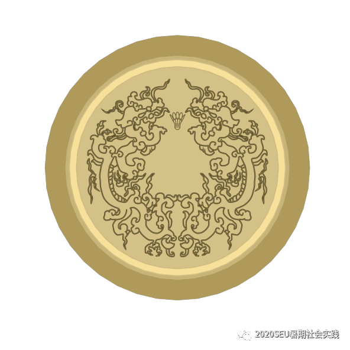
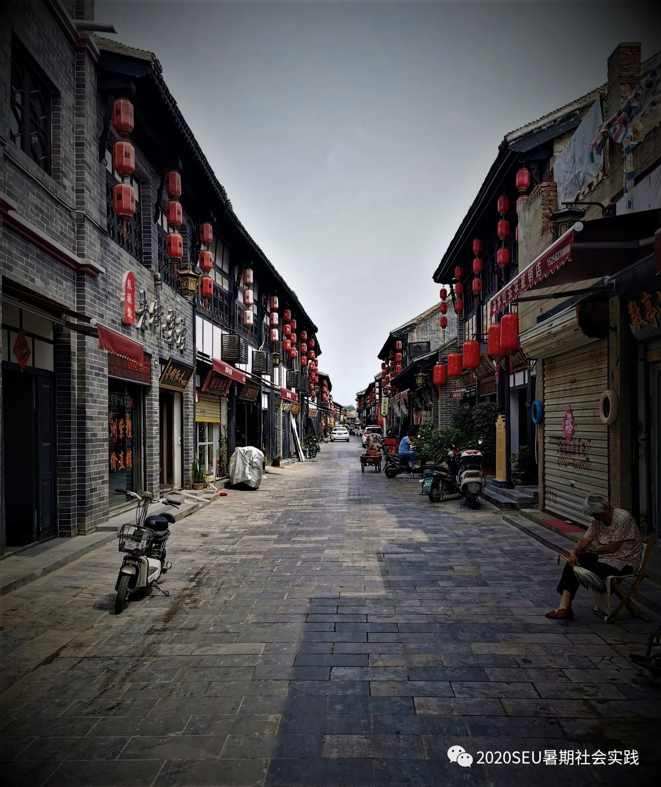
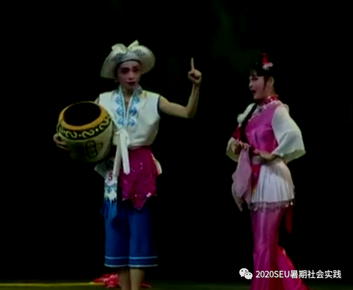
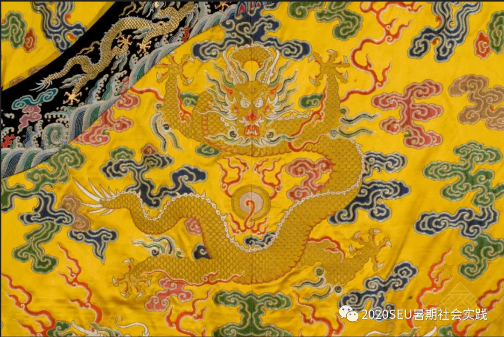

### 实践团队介绍：

 

我们是一支来自东南大学羽毛球协会的实践团队，在传统文化被日益强调的今天，每一个大学生都有责任去深入了解祖国的文化。很多经典的传统文化被大家所熟知，但是大部分传统文化却并不是十分方便去接触，需要我们长途跋涉，跨越很多地域。而一些身边的文化也很有了解的价值，所以本次选题就选择追寻身边熟悉又陌生的传统文化，包含一些传统手艺，珍贵的文物等等。这些平时略有耳闻但并没有详细去了解的文化是需要我们去调查，去了解的。

---

### 最新文章：

- **亳州铜巷**

     

中国是世界上，最早掌握黄铜冶炼技术的文明，姜寨遗址出土的黄铜片和黄铜环就是冶炼而成，距今6700年，中国的青铜冶炼掌握的也较早，目前中国最早的冶炼青铜器为，甘肃马家窑遗址出土的青铜刀，距今也有5000年

 

[阅读原文](https://mp.weixin.qq.com/s?__biz=MzIyMzA0NDAwNw==&mid=2247483728&idx=1&sn=efe96c6d5d46da82f97ee58b92cf278b&chksm=e8250998df52808e545383a167174f10ba7a69f6818df8efb7a9997c9680e3a9753ee3fbe640&mpshare=1&scene=23&srcid=0828DpJPtStsfvgX0AI2K9GF&sharer_sharetime=1598612698173&sharer_shareid=4f39fbbca6595426426f5f14d008d04c#rd)

- **陌生又熟悉的传统文化-云南花灯**

     

花灯剧是云南地方戏曲的主要剧种，是一种古老的民间社会活动。源于明代，流行于全省各地和四川、贵州个别地区。流行在不同地区的花灯又接受了不同的曲种、剧种或民歌小调的影响。云南花灯戏演出的许多剧目，都具有朴素单纯、健康明朗的民间艺术特色，充满着劳动人民的生活气息。

[阅读原文](http://mp.weixin.qq.com/s?__biz=MzIyMzA0NDAwNw==&mid=2247483715&idx=1&sn=0663f1b4e1c81daa974453e3d551ef88&chksm=e825098bdf52809dfacc1479fb906a36949e498c8967600e3c11d8d7c759aa5b55c160fb8f46&mpshare=1&scene=23&srcid=08287kGNa0XEuoIwGpqwjxQT&sharer_sharetime=1598617754502&sharer_shareid=4f39fbbca6595426426f5f14d008d04c#rd
)

- **南京云锦**

     

“南京云锦”是专为帝王将相、王妃公主们做服饰的，云锦中帝王的服饰藻饰华丽，不胜其烦，色彩纹饰皆出章入典。历代帝王自命“真龙天子”，受命于天，驾临人世，统治众生。于是在服饰上大量使用传说中的神兽“龙”的形象，非帝王不准用，以示君临天下，唯我独尊、与天相同。

[阅读原文](http://mp.weixin.qq.com/s?__biz=MzIyMzA0NDAwNw==&mid=2247483714&idx=1&sn=45ce25245e409f781ccf85bf93dafbc3&chksm=e825098adf52809c123b5f8360733fdae1ed94557b7e9ce35760b5488fad3645bff96283bc7c&mpshare=1&scene=23&srcid=0828iXP2OWXfGf4lijiQzAc6&sharer_sharetime=1598617763326&sharer_shareid=4f39fbbca6595426426f5f14d008d04c#rd
)

---

### 微信公众号：

 
欢迎关注我们的微信公众号获取最新的消息

---

### 精选图片

亳州铜巷

云南花灯

南京云锦

